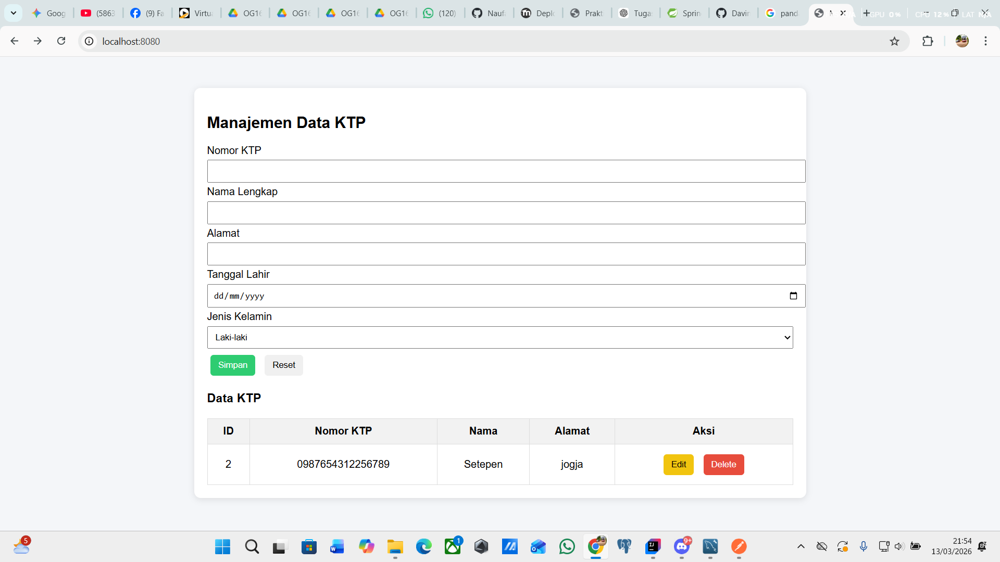
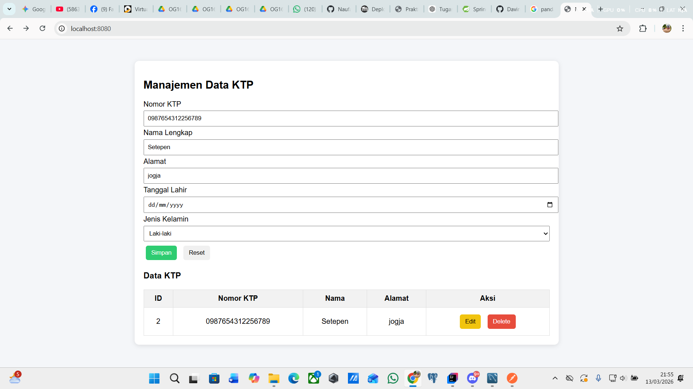
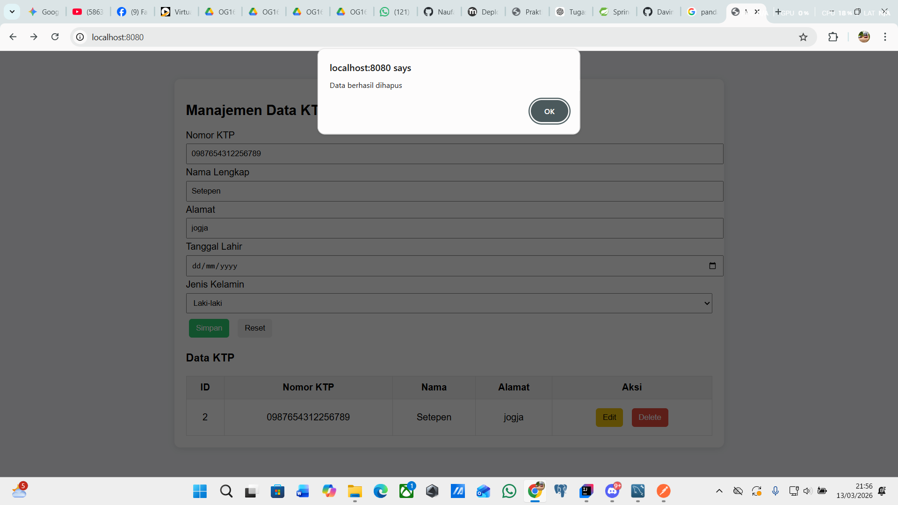
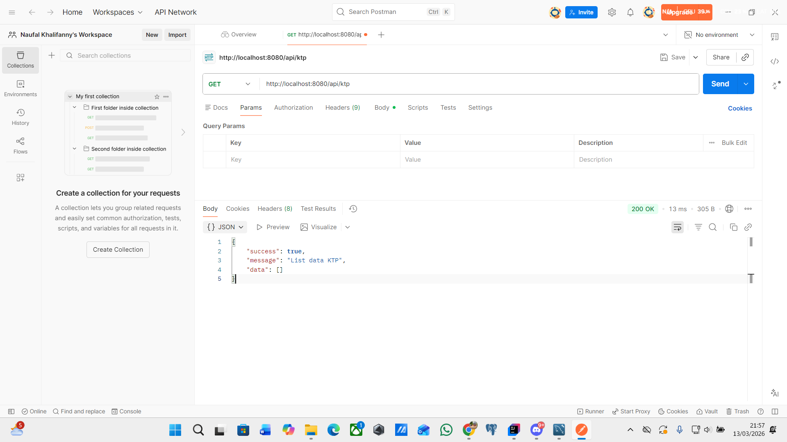
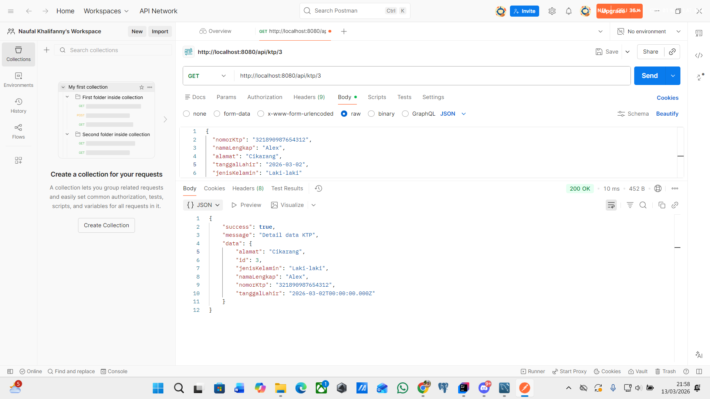
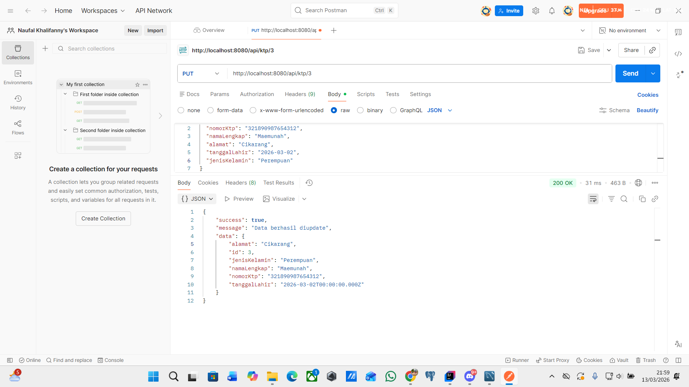
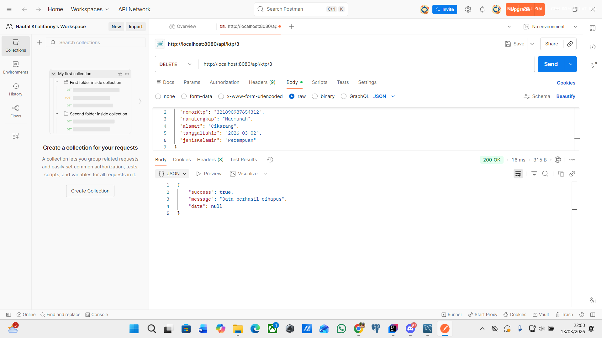

# Manajemen Data KTP (CRUD Spring Boot)

Aplikasi sederhana untuk **mengelola data KTP** menggunakan **Spring Boot sebagai backend API** dan **HTML + jQuery sebagai frontend**.

Aplikasi ini mendukung operasi **CRUD (Create, Read, Update, Delete)** pada data KTP yang tersimpan di database MySQL.

---

# Fitur Aplikasi

* Menampilkan daftar data KTP
* Menambahkan data KTP
* Mengedit data KTP
* Menghapus data KTP
* Integrasi REST API
* Penyimpanan data menggunakan MySQL

---


# Struktur Database

Database: `springs`

Tabel: `ktp`

| Field         | Type                     |
| ------------- | ------------------------ |
| id            | int (PK, AUTO_INCREMENT) |
| nomor_ktp     | varchar                  |
| nama_lengkap  | varchar                  |
| alamat        | varchar                  |
| tanggal_lahir | datetime                 |
| jenis_kelamin | varchar                  |

---

# Endpoint API

Base URL

```
http://localhost:8080/api/ktp
```

| Method | Endpoint      | Deskripsi                       |
| ------ | ------------- | ------------------------------- |
| GET    | /api/ktp      | Menampilkan semua data          |
| GET    | /api/ktp/{id} | Menampilkan data berdasarkan id |
| POST   | /api/ktp      | Menambahkan data                |
| PUT    | /api/ktp/{id} | Mengupdate data                 |
| DELETE | /api/ktp/{id} | Menghapus data                  |

---

# Contoh Request Body (POST / PUT)

```json
{
  "nomorKtp": "0987654312256789",
  "namaLengkap": "Setepen",
  "alamat": "Jogja",
  "tanggalLahir": "2026-03-30",
  "jenisKelamin": "Laki-laki"
}
```

---

# Cara Menjalankan Project

1. Konfigurasi database di file

```
src/main/resources/application.properties
```

Contoh:

```
spring.datasource.url=jdbc:mysql://localhost:3306/springs
spring.datasource.username=root
spring.datasource.password=

spring.jpa.hibernate.ddl-auto=update
```

2. Jalankan aplikasi

```
mvn spring-boot:run
```

atau dari IDE.

3. Buka aplikasi di browser

```
http://localhost:8080
```

---

# Tampilan Aplikasi

Halaman utama menampilkan:

* Form input data KTP
* Tabel daftar data
* Tombol Edit dan Delete

---



#


#


#


# Postman








